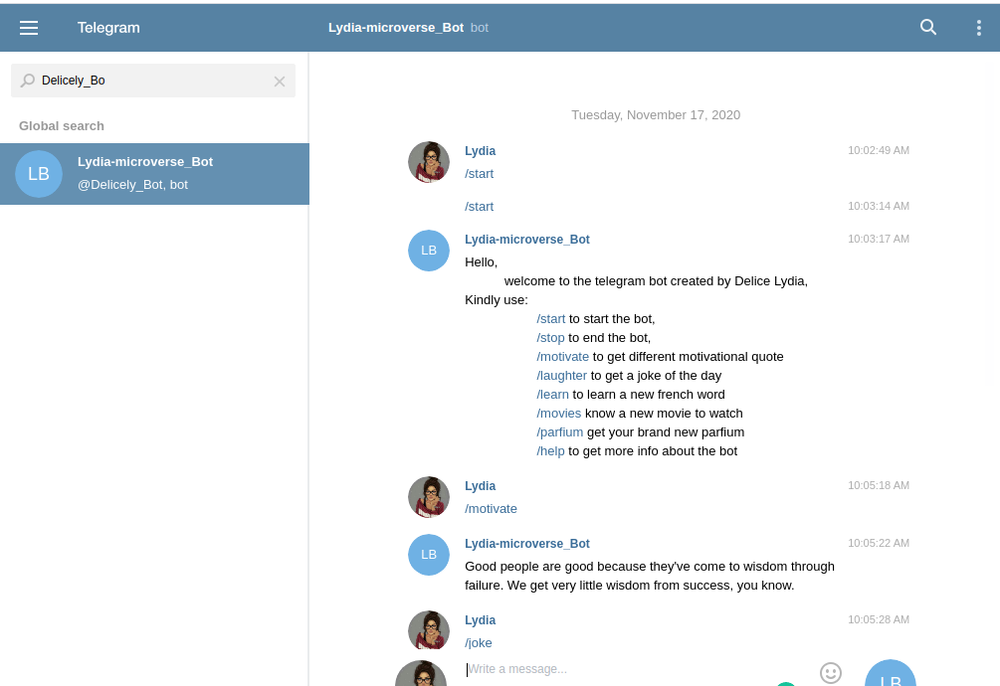

# Capstone-Telegram-Bot

## About the Project

This project consist of building a Telegram Bot using Ruby, With this Bot you can get a daily motivation,
joke, new movie to watch, learn a new french word etc.

## Built With

* [Ruby](https://www.ruby-lang.org/en/)
* VS Code
* Telegram-Bot API
* Type fit Quotes API
* Yo mamma Jokes API

## Tested With

* Rspec

## Getting Started
​
To get a local copy up and running follow these simple example steps.
​
1. On the project GitHub page, navigate to the main page of the repository.
2. Under the repository name, locate and click on a green button named `Code`. 
3. Copy the project URL as displayed.
4. If you're running the Windows Operating System, open your command prompt. On Linux, Open your terminal. 
5. Change the current working directory to the location where you want the cloned directory to be made. Leave as it is if the current location is where you want the project to be. 
6. Type git clone, and then paste the URL you copied in Step 3.  
e.g. $ git clone https://github.com/yourUsername/yourProjectName 
7. Press Enter. Your local copy will be created. 
8. Go into the folder you cloned in this step 7 on your terminal
e.g. $ cd Desktop/Capstone-Telegram-Bot
9. Create an account on Telegram
10. Navigate to your Telegram account
11. Create a new bot using @BotFather
12. get the token and replace it with the given token
13. Run `bin/main.rb` 
14. Then run the commands in your bot
15. Type commands like:
* /start to start the bot
* /motivate to get a motivational quote
* /laughter to get a joke of the day
* /movies to get a new movie to watch
* /learn to learn a new french word
* /parfium to know a brand new parfume to buy
* /help to get more info about the bot
* /stop to end the bot

## Contributing
​
Contributions, issues, and feature requests are welcome!
Feel free to check the [issues page](../../issues).

1. Fork the Project
2. Create your Feature Branch (`git checkout -b feature/AmazingFeature`)
3. Commit your Changes (`git commit -m 'Add some AmazingFeature'`)
4. Push to the Branch (`git push origin feature/AmazingFeature`)
5. Open a Pull Request

## Author
​
👤 **Delice Lydia**
​
- Github: [@DeliceLydia](https://github.com/DeliceLydia)
- Twitter: [@IngabireLydia3](https://twitter.com/IngabireLydia)
- Linkedin: [Delice Lydia](https://www.linkedin.com/in/delice-lydia)

## Acknowledgments

Huge Thanks to [Atipugin](https://github.com/atipugin/telegram-bot-ruby) for the project inspirations

## Show your support
​
Give a ⭐️ if you like this project!